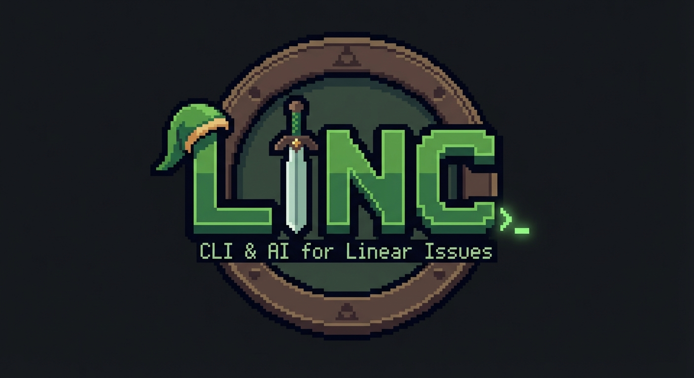

<p align="center">
  
</p>

# linc

**Linear + Code** - A CLI tool that bridges Linear issues to AI coding agents.

Browse your Linear issues in a beautiful TUI, select one, and instantly launch your preferred AI coding agent (Claude Code, opencode, etc.) with full issue context.

## Features

- Browse Linear issues by status (Todo, In Progress, etc.)
- Filter and search issues
- Automatic branch creation from Linear's suggested branch names
- Syncs comments to Linear before starting work
- Moves issues to "In Progress" automatically
- Multi-workspace support with directory mapping
- Provider system for multiple AI agents (Claude Code, opencode, echo for testing)

## Planned

- [ ] opencode provider support
- [ ] Custom prompt templates
- [ ] Issue creation from CLI

## Installation

```bash
curl -fsSL https://raw.githubusercontent.com/franzwilhelm/linc/main/install.sh | bash
```

See [alternative installation methods](docs/usage.md#alternative-installation-methods) for Go install or building from source.

## Documentation

See the [Usage Guide](docs/usage.md) for navigation, configuration, and provider info.

## Support

If you find linc useful, consider buying me a coffee:

<a href="https://www.buymeacoffee.com/franzwilhelm" target="_blank"></a>

## License

MIT

## Contributing

Contributions welcome! Please open an issue or PR.
